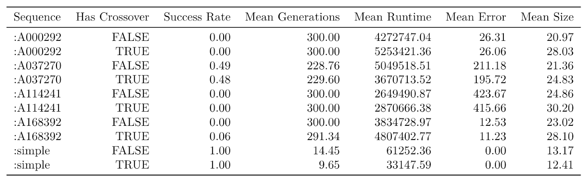

# IntSeq

A Clojure library designed to find closed-form expressions for integer sequences, using Genetic Programming techniques. Created by [Eniola Ajao](https://github.com/eajao1), [Maria-Cristiana Gîrjău](https://github.com/mcgirjau), and [Alexander Lee](https://github.com/alexlee311), and based on the [`propel` framework](https://github.com/lspector/propel) by [Lee Spector](https://github.com/lspector).

## Usage

To try out IntSeq for yourself, first clone the repository on your own system, and `cd` to it:

```bash
git clone https://github.com/COSC452/intseq.git
cd intseq
```

Once inside the project, you can run the program using `lein run` and providing the following arguments:

* \<int> **population-size**, e.g. 200
* \<int> **generations**, e.g. 200
* \<keyword> **seq-id**, one of :simple, :A037270, :A000292, :A114241, :A168392, :A005132
* \<keyword> **selection-type**, one of :lexicase-selection, :tournament-selection
* \<int> **tournament-size**, e.g. 7 (will be ignored if using lexicase selection)
* \<boolean> **crossover?**, true or false
* \<keyword> **crossover-type**, one of :single-point-crossover, :uniform-crossover, :umad-crossover
* \<boolean> **mutate?**, true or false
* \<float> **umad-add-rate**, in range [0, 1.0], e.g. 0.09
* \<float> **umad-del-rate**, in range [0, 1.0], e.g. 0.1
* \<boolean> **elitism?**, true or false
* \<boolean> **report?**, true or false
* \<boolean> **export-stats?**, true or false

With `report?` set to true, a summary of each generation will be printed to the shell's standard output. This is what the average user would probably be interested in. 

With `export-stats?` set to true, a summary of the entire run will be written to a .csv file in the `data/` subdirectory, and an informative string about the program's outcome will be printed to the shell's standard output. Only use this option if you intend to collect data for analysis. 

Note that setting `export-stats?` to true will automatically set `report?` to false.

### Example Run

An example run would be:

```bash
lein run 200 200 :simple :lexicase-selection 0 true :single-point-crossover true 0.09 0.1 true true false
```

If you know what you're doing, feel free to edit the code or play around with it in a REPL. You can also add in more sequences of your choosing by following the structure in `seqs.clj`.

## Motivation

After browsing the [On-Line Encyclopedia of Integer Sequences (OEIS)](https://oeis.org/), we noticed that many of the sequences listed in their database did not have formulas. Since Genetic Programming (GP) is particularly well-suited for discovering solutions to problems that humans don't (yet) know how to solve directly, we saw this as an opportunity to create a program that takes advantage of GP to find such missing formulas. Particularly, we aimed to solve the problem of finding a closed-form expression for the famous [Recamán sequence](https://en.wikipedia.org/wiki/Recam%C3%A1n%27s_sequence). 

IntSeq attempts to find a formula that holds for the first  terms in some sequence. Our program also tries to avoid local overfitting by testing the accuracy of the resulting formula on terms  and beyond. As our ultimate goal, we selected the mathematically-significant and aesthetically-appealing Recamán sequence because, while expressions do exist to compute its terms, they are all *recursive*, and not closed-form.

As a secondary investigation, we ran our program on five test sequences in order to determine whether UMAD with single-point crossover or UMAD without crossover performs better for this particular problem at hand (i.e. finding a formula for some integer sequence).

## What We Did

Built with a minimalist stack-based genetic programming approach in mind, IntSeq is composed of three namespaces: `seqs.clj`, `ops.clj`, and `core.clj`. 


### `seqs.clj`

The first namespace, `seqs`, is a collection of all the sequences we used, as well as some helper functions that split a sequence into training and testing terms. Our sequences are divided into two categories: 

* **Test sequences**
* **Mathematically-significant sequences**

Test sequences are sequences with already-existing formulas, and include [A037270](https://oeis.org/A037270), [A000292](https://oeis.org/A000292), [A114241](https://oeis.org/A114241), [A168392](https://oeis.org/A168392), as well a simple sequence we created ourselves based on the polynomial . These test sequences were used to compare the performance of UMAD with single-point crossover and UMAD with no crossover. 

On the other hand, our mathematically significant sequence, the [Recamán Sequence](https://oeis.org/A005132), currently has no closed-form formula, which we aimed to discover through Genetic Programming.

### `ops.clj`

The second namespace, `ops`, includes stack implementations of different integer operators that can be used as `ingredients` for a closed-form mathematical expressions. Such operators include addition, subtraction, multiplication, integer division, max, min, etc.

### `core.clj`

Our final namespace is `core`; this is where our main code employing evolutionary techniques is located. Given inputs such as population size or generation cap, `core` maintains a population of digital genomes that represent closed-form formulas. It implements various genetic operators, including a variety of selection, crossover, and mutation subtypes, and ultimately runs a Genetic Programming algorithm to find and return a function that best describes some sequence.

Our selection methods include **lexicase** and **tournament** selection. As for crossover, options include **single-point** crossover, **uniform** crossover, and what we refer to as **UMAD** crossover ("Uniform Mutation by Addition and Deletion"). UMAD crossover is the type of crossover used in the paper ["*Program synthesis using uniform mutation by addition and deletion*"](https://dl.acm.org/doi/10.1145/3205455.3205603) by Helmuth, McPhee, and Spector. Unlike the other types of crossover we implemented, UMAD crossover works by adding elements from one genome into another genome, and then deleting certain elements from the result.

### Cluster Computing

In addition to these three namespaces, we set up our repository to run on the Condor Computing Cluster for efficiency and convenience. We executed all our runs in the cluster, hoping to find a closed-form expression for the Recamán Sequence, as well as testing whether UMAD with single-point crossover performs better than UMAD with no crossover. 

For the latter endeavor, we investigated both scenarios through 100 independent runs per treatment, for all 5 test sequences (a total of  runs). We fixed all parameters except the ones of interest in an effort to reduce variability. As such, we tried to pick conventionally-optimal parameters used in previous research:
 
 1. population size: **1000**
 2. generation cap: **300**
 3. selection type: **lexicase** selection
 4. mutation: **UMAD**
 5. UMAD addition rate: **0.09**
 6. UMAD deletion rate: **0.1**
 7. **elitism**

Note that we chose to use **shrinking UMAD** since it exhibits less variability over a large number of generations, thus making it more appropriate for an experimental design investigating differences between two groups. 

## Results

As mentioned, we began with the hypothesis that UMAD with single-point crossover would perform better, on average, than UMAD with no crossover, in terms of metrics like success rate, average runtime, or average best error. Below are our results, aggregated by test sequence and experimental treatment:



**Our program found solutions for 3 out of the 5 test sequences (simple, A037270, A168392).**

Overall we observed **no significant performance differences** between the two, but some patterns did emerge:

* UMAD with crossover was more successful for more "complex" sequences, e.g. A168392, 
* UMAD with crossover was faster for "simpler" sequences e.g. simple or A037270, 
* UMAD with crossover tends to increase the average size of genomes across the board, 

These results suggest that integer sequences might be better investigated in subtypes (e.g. "simple" and "complex", as determined by some definition).

### Recamán Sequence

Using the same fixed parameters as for our aforementioned experiment, we ran our program on the Recamán Sequence with both single-point crossover and no crossover. Since the Recamán Sequence can be considered more "complex", we expected better results from UMAD with crossover. Indeed, we did find a significant difference in the average error of the two methods, with  as seen below:

* UMAD with crossover: mean error of **18.74** (range 14-20)
* UMAD without crossover: mean error of **20.54** (range 17-23)

No other metrics (e.g. success rate or average runtime) could be compared, given that the program did not ultimately find a closed form, with the lowest best error aggregated over 10 terms being 14 (in UMAD with crossover). More experimentation and code improvement might be necessary for a Mathematical breakthrough.

## Improvements

Possible directions for future work could include the implementation, usage, and optimization of more Mathematical operators, the identification of “sequence subtypes” and individual analyses thereof, further optimization of parameters, an increased number of test runs for data collection, as well as the incorporation of simplification algorithms for the genomes.
